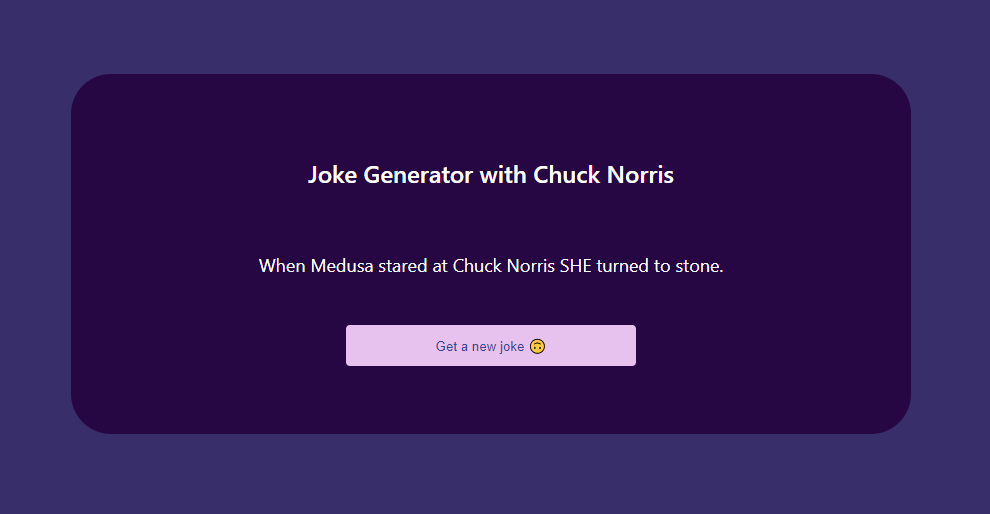

# fetch-data-from-random-jokes-API

## This is just an example to fetch data from random joke API with useState and useEffect hooks.🥰
### `JavaScript`
### `ReactJs`
### `styled-components`
### `API`

